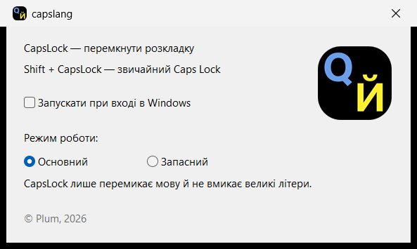

# capslang


Перемикання розкладки клавіатури по **CapsLock** для Windows 11.
**Shift + CapsLock** — звичайний Caps Lock.

*Keyboard layout switcher for Windows 11: tap CapsLock to switch layouts,
Shift+CapsLock for regular Caps Lock. Single-file tray app, no dependencies.*



## Механізм

- `RegisterHotKey(VK_CAPITAL, MOD_NOREPEAT)` — система проковтує CapsLock до того,
  як його побачить будь-який застосунок; реєстрація ексклюзивна і не зникає з
  часом (на відміну від low-level hook, який Windows тихо знімає за повільний
  колбек, а пізніше встановлені хуки перехоплюють клавішу першими).
- Перемикання: `WM_INPUTLANGCHANGEREQUEST` (через `PostMessage`, неблокуюче) у
  реально сфокусоване вікно (`GetGUIThreadInfo().hwndFocus` — коректно для UWP).
- Маніфест `requireAdministrator`: без нього UIPI блокує повідомлення у бік
  elevated-вікон (адмінський термінал, regedit) — Caps ковтався б, а розкладка
  не перемикалась. Наслідок: ручний запуск — через UAC-промпт.
- Автозапуск (чекбокс у вікні) = задача Task Scheduler **`capslang`**
  (`ONLOGON`, `RL HIGHEST`) — стартує elevated БЕЗ UAC-промпта. Run-ключ реєстру
  для elevated-програм не працює, тому саме задача.

## Використання

- `capslang.exe` — сидить у треї. Лівий клік по іконці або повторний запуск
  exe — вікно налаштувань (автозапуск on/off). Правий клік — меню з «Вихід».
- Іконка трею переживає перезапуск Explorer (обробка `TaskbarCreated`).
- Один екземпляр (named mutex `capslang_single_instance`).

## Готовий exe

Останній реліз — на вкладці [Releases](../../releases): `capslang.exe`
збирається GitHub Actions на `windows-latest` і чіпляється до релізу.
Новий реліз = пуш тега:

```powershell
git tag v1.0.0
git push origin v1.0.0
```

Ручний запуск workflow (вкладка Actions → build → Run workflow) лише збирає
exe і кладе його в артефакти прогону, релізу не створює.

Exe не підписаний, тож при першому запуску Windows SmartScreen покаже
попередження («More info» → «Run anyway»).

## Збірка локально

```powershell
powershell -ExecutionPolicy Bypass -File build.ps1
```

Потрібен лише LLVM-MinGW (`winget install MartinStorsjo.LLVM-MinGW.UCRT`) —
`build.ps1` сам знаходить toolchain у winget-пакеті. Результат: один
самодостатній `capslang.exe` (~300 КБ, статичний лінк, без зовнішніх DLL).

## Файли

| Файл | Що це |
|---|---|
| `capslang.cpp` | весь код утиліти |
| `capslang.manifest` | requireAdministrator + dpiAware + visual styles |
| `capslang.rc` | іконка, маніфест і PNG-логотип у ресурси exe |
| `build.ps1` | збірка (windres + clang++, статичний лінк) |
| `capslang.ico` | іконка exe і трею |
| `capslang.png` | той самий логотип; вшивається в exe і малюється у вікні (GDI+) |
| `screenshot.png` | вигляд вікна налаштувань |
| `.github/workflows/release.yml` | CI: збірка на Windows + реліз із exe по тегу `v*` |

## Відомі обмеження

- Якщо CapsLock уже зареєстрував хтось інший — при старті буде помилка
  (це навмисно: чесніше за мовчазний конфлікт двох хуків).
- Задача автозапуску тригериться на логон будь-якого користувача машини
  (стандартна поведінка `schtasks /SC ONLOGON`); на однокористувацькій
  машині неважливо.
- `capslang.ico` містить один розмір (128×128) — для трею Windows масштабує
  його сам. Якщо іконка в треї здається м'якою, у .ico варто додати кадри
  16/24/32/48.
